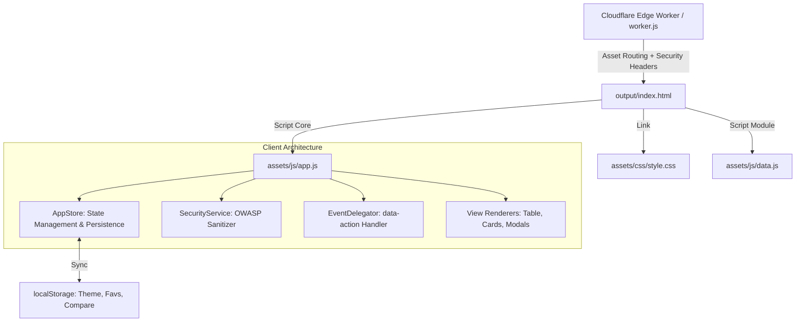

# 🏗️ Especificación de Arquitectura de Software & Clean Architecture

**Sistema:** Plataforma de Gestión y Postulación Estratégica SENA ADSO  
**Autor:** Juan Manuel Lagos Monroy  
**Estándar:** ISO/IEC 25010 (Calidad del Producto), ISO/IEC 27001 (Seguridad), OWASP Top 10, WCAG 2.1 AA  

---

## 1. Principios de Diseño y Clean Architecture

La solución implementa una **Arquitectura JAMstack Desacoplada** basada en el patrón **Model-View-ViewModel (MVVM) / Store Pattern** en el cliente, optimizada para ejecución sin latencia en el Edge CDN de **Cloudflare Workers**:

---

## 2. Capas de Responsabilidad (Separation of Concerns)

### A. Capa de Presentación (View Layer)
- **`output/index.html`**: Estructura declarativa semántica HTML5 pura.
  - **Zero Inline JavaScript**: Cero atributos `onclick` o scripts embebidos en etiquetas; toda la interacción se realiza mediante atributos de datos `data-action="..."`.
  - **Accesibilidad (WCAG 2.1 AA)**: Jerarquía semántica (`<header>`, `<main>`, `<section>`, `<article>`, `<aside>`), roles ARIA (`role="search"`, `role="dialog"`, `aria-modal="true"`) y soporte para `prefers-reduced-motion`.
- **`output/assets/css/style.css`**:
  - Tokens de diseño centralizados mediante Variables CSS nativas.
  - Soporte completo para temas claro y oscuro (`[data-theme="dark"]`, `[data-theme="light"]`).
  - Layout elástico con `flexbox` y `css grid` adaptable a viewports portátiles (`1280x585`, `1366x768`) y pantallas de alta resolución.

### B. Capa de Dominio y Estado (State & Domain Layer)
- **`output/assets/js/app.js`**:
  - **`CONFIG` & `CANDIDATE`**: Inmutabilidad de configuraciones y credenciales del candidato mediante `Object.freeze`.
  - **`AppStore`**: Fuente única de verdad (*Single Source of Truth*) para filtros, paginación, selección de favoritos y comparador dock.
  - **`SecurityService`**: Prevención activa contra Cross-Site Scripting (XSS) y manipulación de DOM insegura mediante `escapeHtml`.
  - **`AppController`**: Despachador central de eventos (*Event Delegator*) que escucha eventos globales de clic y cambio en el DOM, reduciendo el consumo de memoria y evitando fugas (*memory leaks*).

### C. Capa de Datos (Data Layer)
- **`output/assets/js/data.js`**: Módulo JavaScript que expone el dataset sincronizado para compatibilidad inmediata tanto en entornos locales (`file:///`) como en producción.
- **`output/assets/data/empresas.json`**: Dataset estructurado en formato JSON estándar (2 espacios) para consumo por APIs externas.

### D. Capa de Seguridad y Despliegue en el Edge (Edge Security Layer)
- **`worker.js`**: Enrutador de Cloudflare Worker que intercepta todas las peticiones y añade cabeceras de blindaje:
  - `Content-Security-Policy (CSP)`
  - `Strict-Transport-Security (HSTS)`
  - `X-Content-Type-Options: nosniff`
  - `X-Frame-Options: DENY`
  - `Referrer-Policy: strict-origin-when-cross-origin`
  - `Permissions-Policy`

---

## 3. Matriz de Cumplimiento de Normativas

| Norma / Estándar | Requisito Técnico | Estado |
| :--- | :--- | :---: |
| **ISO/IEC 25010: Rendimiento** | Carga del bundle en < 200 ms, cero dependencias pesadas de frameworks | ✅ Cumplido |
| **ISO/IEC 25010: Mantenibilidad** | Código modular con estricta separación de capas y funciones puras | ✅ Cumplido |
| **ISO/IEC 27001: Seguridad** | Prevención de fuga de datos, enlaces seguros `rel="noopener noreferrer"`, cabeceras Edge | ✅ Cumplido |
| **OWASP A03:2021 (Inyección)** | Sanitización contextual en todas las inserciones del DOM | ✅ Cumplido |
| **ISO 9241-210: Ergonomía y Usabilidad** | Navegación por teclado (`Escape`), contraste cromático validado | ✅ Cumplido |
