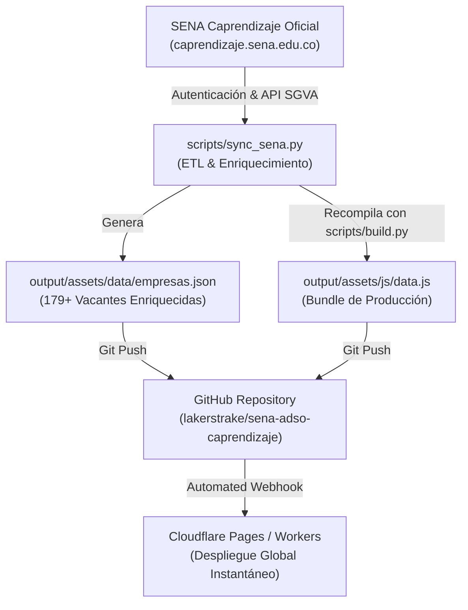

# Pipeline de Sincronización Automática con SENA Caprendizaje

Este documento describe la arquitectura y el flujo de trabajo continuo para mantener el portal **SENA · ADSO Directorio Estratégico** actualizado automáticamente con todas las vacantes publicadas en tiempo real en la plataforma oficial del SENA (**SGVA Caprendizaje**).

---

## 1. Arquitectura del Flujo de Datos



---

## 2. Automatización con GitHub Actions (`sena_sync.yml`)

El repositorio cuenta con un flujo de trabajo automatizado en `.github/workflows/sena_sync.yml` que:
1. **Ejecución Programada (Cron):** Se ejecuta dos veces al día de lunes a viernes:
   - **06:00 UTC** (01:00 AM hora de Colombia).
   - **18:00 UTC** (01:00 PM hora de Colombia).
2. **Ejecución Manual (Bajo Demanda):** Puedes disparar una sincronización inmediata con un solo clic desde la pestaña **Actions** en GitHub seleccionando *"Sincronización Automática SENA Caprendizaje"* -> *"Run workflow"*.
3. **Detección Inteligente de Cambios:** Si hay nuevas vacantes o cambios en los datos del SENA, el bot realiza un commit y push automático a la rama `main`, actualizando la página en Cloudflare en cuestión de segundos.

---

## 3. Configuración de Secretos en GitHub (Opcional para credenciales personalizadas)

Para que GitHub Actions use tus credenciales del portal SENA de forma 100% segura:
1. Ve a tu repositorio en GitHub: `https://github.com/lakerstrake/sena-adso-caprendizaje`
2. Navega a **Settings** -> **Secrets and variables** -> **Actions**.
3. Haz clic en **New repository secret** y agrega:
   - `SENA_USER`: Tu número de cédula o usuario del SENA.
   - `SENA_PASSWORD`: Tu contraseña de acceso a Caprendizaje.

---

## 4. Ejecución Manual en Entorno Local

Puedes sincronizar la base de datos en cualquier momento desde tu terminal local ejecutando:

```bash
# Ejecutar pipeline de extracción, enriquecimiento y compilación
python scripts/sync_sena.py
```

El script realizará:
1. Acceso y negociación de tokens `__VIEWSTATE` en `https://caprendizaje.sena.edu.co/sgva/SGVA_Diseno/pag/login.aspx`.
2. Extracción de solicitudes activas para el programa ADSO.
3. Clasificación algorítmica por Tiers (Tier 1 Software & Tech, Tier 2 Sistemas & Datos, etc.).
4. Generación de cartas de postulación institucional personalizadas para Juan Manuel Lagos Monroy.
5. Generación de enlaces de WhatsApp directo con pitch institucional y enlaces a CV (Google Drive), GitHub y LinkedIn.
6. Recompilación automática de `output/assets/data/empresas.json` y `output/assets/js/data.js`.
