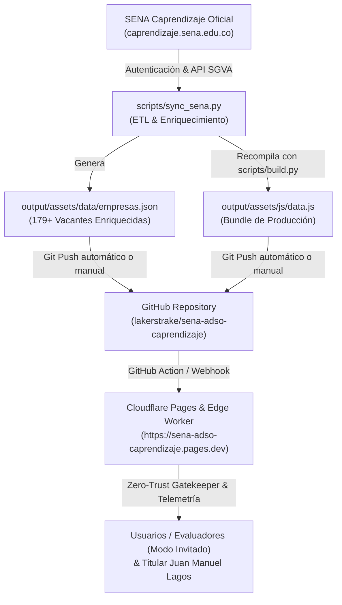

# Pipeline de Sincronización y Despliegue en Cloudflare (SENA Caprendizaje)

Este documento describe la arquitectura integral y los flujos continuos para mantener el portal **SENA · ADSO Directorio Estratégico** sincronizado automáticamente con la plataforma oficial del SENA (**SGVA Caprendizaje**) y desplegado globalmente en **Cloudflare Pages / Workers**.

---

## 1. Arquitectura del Flujo de Datos y Despliegue Global



---

## 2. Automatización Continua en GitHub Actions

### A. Sincronización Automática con el SENA (`.github/workflows/sena_sync.yml`)
* **Cron Programado:** Se ejecuta automáticamente 2 veces al día de lunes a viernes:
  * **06:00 UTC** (01:00 AM hora de Colombia).
  * **18:00 UTC** (01:00 PM hora de Colombia).
* **Bajo Demanda:** Disparable con 1 clic desde la pestaña **Actions** en GitHub.
* **Auto-Commit:** Si se detectan nuevas vacantes o modificaciones en las solicitudes de empresas, realiza commit y push automático a la rama `main`.

### B. Despliegue Automático en Cloudflare (`.github/workflows/deploy_cloudflare.yml`)
* **Despliegue Instantáneo:** Cada push a la rama `main` compila el bundle estático y publica la versión más reciente en la red global de Cloudflare (Edge CDN).

---

## 3. Configuración de Secretos en GitHub

Para que los flujos de GitHub Actions se ejecuten de manera 100% autónoma:
1. Ve a tu repositorio: `https://github.com/lakerstrake/sena-adso-caprendizaje`
2. Navega a **Settings** -> **Secrets and variables** -> **Actions**.
3. Asegúrate de tener configuradas las siguientes variables:
   * `SENA_USER`: Tu cédula o usuario de Caprendizaje (ej. `1074808317`).
   * `SENA_PASSWORD`: Tu contraseña de acceso al portal SENA.
   * `CLOUDFLARE_API_TOKEN`: Token de API con permisos de edición en Cloudflare Pages / Workers.
   * `CLOUDFLARE_ACCOUNT_ID`: ID de tu cuenta de Cloudflare.

---

## 4. Ejecución y Sincronización Manual Local

Puedes ejecutar la sincronización y compilar en cualquier momento en tu máquina:

```bash
# 1. Extraer y enriquecer datos desde el SENA
python scripts/sync_sena.py

# 2. Recompilar bundle estático y validar datos
python scripts/build.py

# 3. Ejecutar suite de pruebas de seguridad y responsividad
python scripts/test_security_suite.py
python scripts/test_e2e_security.py
python scripts/test_responsive_viewports.py

# 4. Desplegar localmente con Wrangler (opcional)
npx wrangler pages deploy output --project-name=sena-adso-caprendizaje
# o para el Edge Worker:
npx wrangler deploy
```
